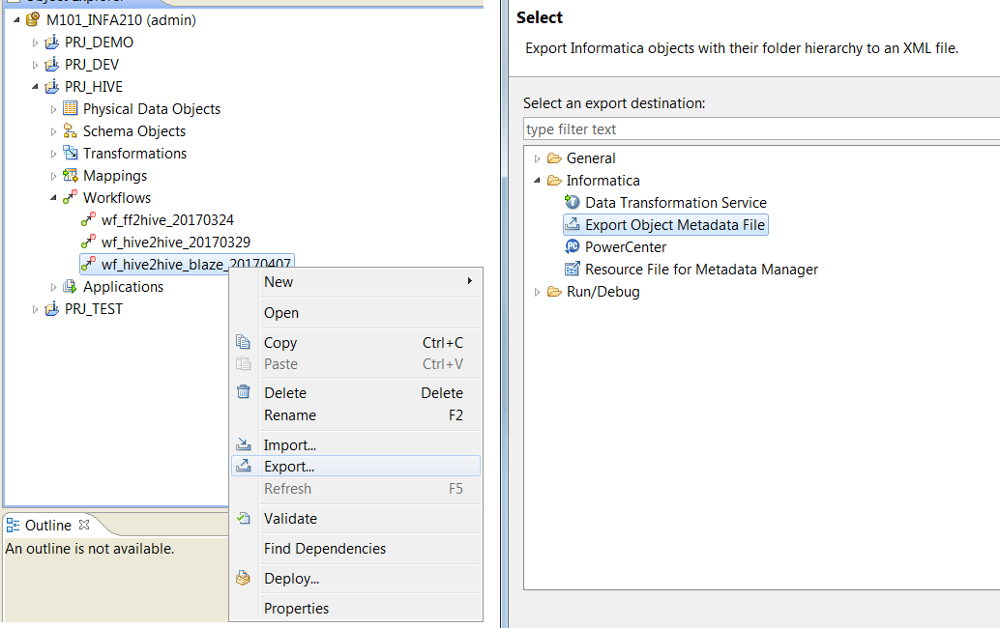

# Mercury Platform元数据迁移

同传统的PowerCenter的元数据迁移一样， 如何没有看过的，可以查看
[PowerCenter元数据迁移](../PWC/MigrationA.md)，

演示环境
> Informatica 10.1.1
> 
> BDM 10.1.1
> 
> Cloudera 5.8

简短版
> 导出
> 
> 相同版本之间的导入
> 
> 不同版本之间的导入
> 
> 注意事项

## 导出

点击对应的对象，然后右键，在菜单里选择Export，根据不同的对象和要求，可以在后续菜单做操作。

一般使用最多的就是Export Object Metadata File了，它可以将对应的对象导出为XML文件。

如果是PowerCenter，那么可以导出到传统的PowerCenter资料库里。

## 相同版本之间的导入

如果PowerCenter BDM版本一样的话，
