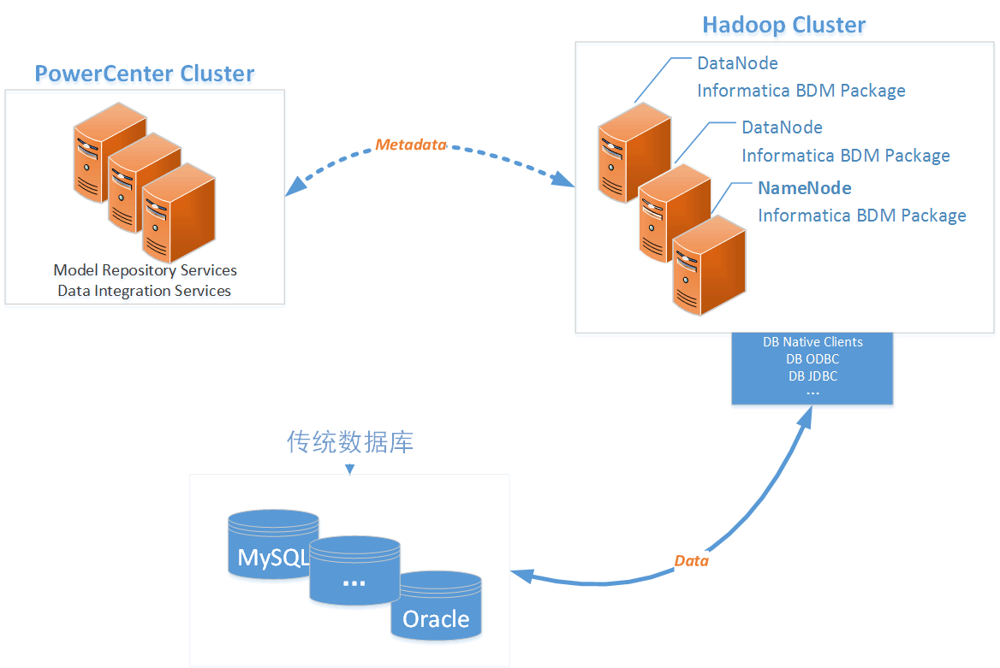

# BDM （Big Data Management）

现在**大数据**，**大数据分析**，**机器学习**，**人工智能**等等一直是很火的话题，刚好最近在弄BDM等一些事情，有些想法，这里就写一些心得吧。

我在使用sklearn + pandas做一些数据分析，就数据分析而言，数据清理的时间占用了数据分析的大部分时间。所以一份数据的格式和内容是否符合处理的场景真的很重要。

## INFA BDM架构

 

INFA BDM架构，这是我自己理解画的图。

- PowerCenter Cluster

PowerCenter cluster里是与BDM相关的主要服务：Model Repository Services和Data Integration Services。

- Hadoop Cluster

Hadoop Cluster节点需要安装Informatica BDM Package，当然这些都不用手动一个节点一个节点的去安装，Informatica BDM Tools可以做这些事情。当然也可以通过parcel来安装。

- 传统数据库
这里都是一些结构化数据，可能需要将Hadoop里的非结构化数据库转化之后传输到这里。

- Metadata

PowerCenter Cluster与Hadoop Cluster直接传递一些元数据和指令，同时Hadoop Cluster将状态等信息反馈
给PowerCenter Cluster，所以PowerCenter Administrator Console（AC）会实时查看到job的状态。所以这里并没有真实数据的流动。

## BDM运行模式
BDM有两种运行模式，
- Native
这个模式主要是处理一些Hadoop数据与传统数据直接的处理。如果要使用Native Connection的话，需要将对应DB Native Client安装到所有的Hadoop节点上。

- Hadoop
hadoop运行模式，又分为了三种引擎：
 - Hive 	
 - Blaze
 - Spark

除了Blaze，大家都应该很熟悉了。其实Blaze引擎是Informatica自己研发的，三种引擎都有优劣，需要根据实际情况来选择。

后面再慢慢来讲BDM，或许在结合panda+sklearn做一些实际的示例。
