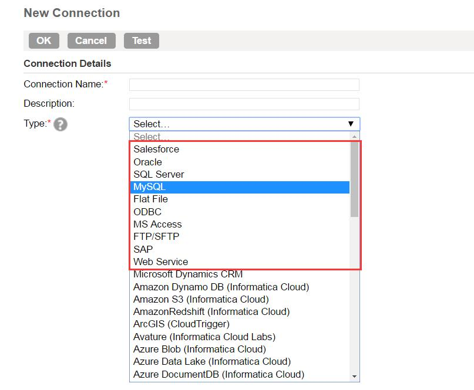
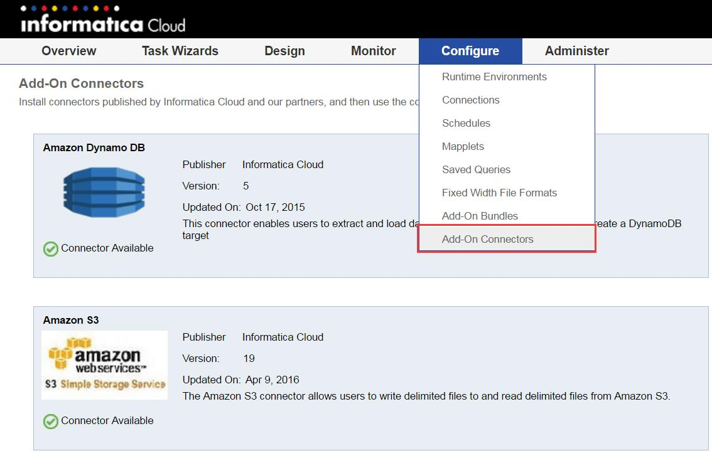
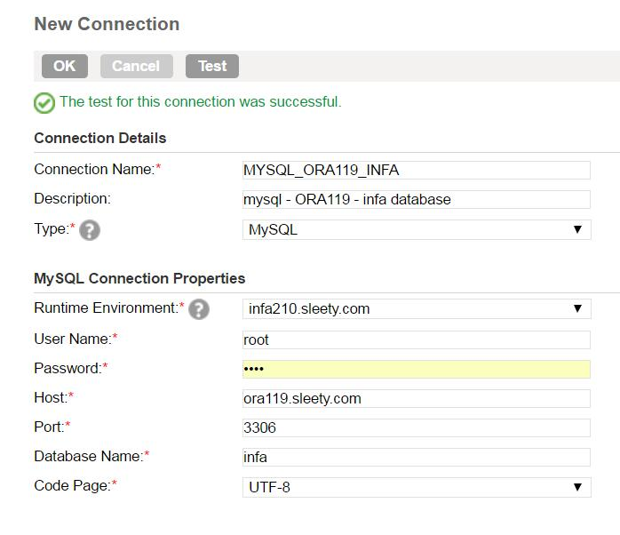
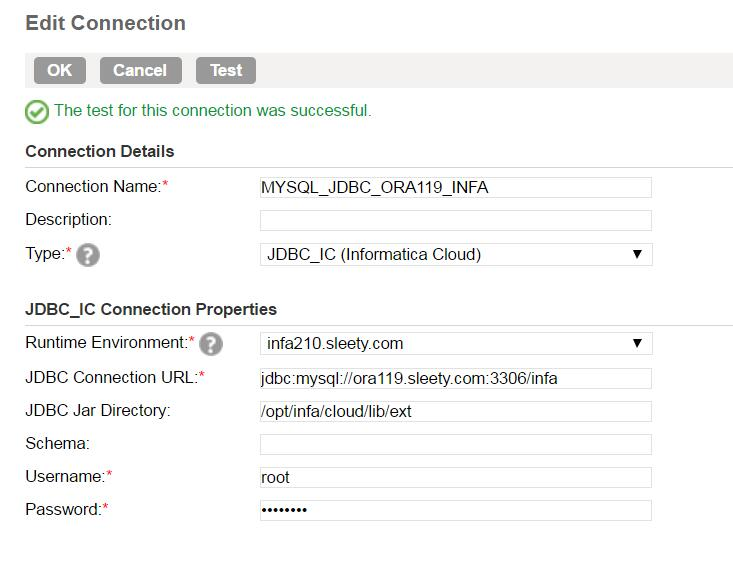

#连接
INFA Cloud的连接相当丰富，除了一些常规的连接类型外，还有很多的插件(Add-On)可选。见图1，在红色方框里的连接类型都是常规的连接类型。想要开启其它连接插件，请参考图2

 图1

 图2

##Salesforce
Configure -> Connection -> New 填写相关信息

点击Test。如果测试失败，请查看[Cloud FAQ](../../FAQ/CLOUD/README.md)

##MySQL
#####MySQL Type
Configure -> Connection -> New 填写相关信息

点击Test。

#####MySQL JDBC Type
创建JDBC连接，需要开启JDBC_IC(Informatica Cloud)插件(Add-on).

如果失败了，请查看[Cloud FAQ](../../FAQ/CLOUD/README.md)

