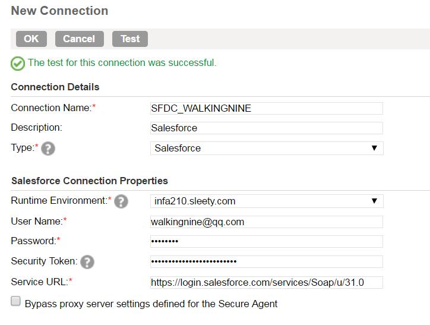

#连接

##Salesforce
Configure -> Connection -> New 填写相关信息

点击Test。如果测试失败，请查看[Cloud FAQ](../../FAQ/CLOUD/README.md)

##MySQL
#####MySQL Type
Configure -> Connection -> New 填写相关信息

点击Test。

#####MySQL JDBC Type
创建JDBC连接，需要开启JDBC_IC(Informatica Cloud)插件(Add-on).

