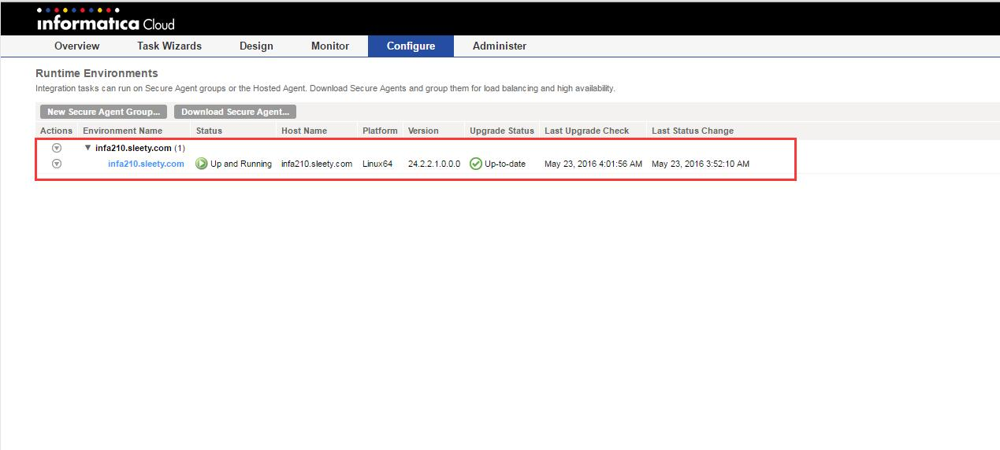

#Informatica Cloud
现在大数据和Cloud很火热，而Informatica Cloud的产品很早就出了，我好像是在2014年接触了一下，后来一直很忙于其他事情，没有持续的研究。现在又开始接触了，这里就记录一下。

##注册
1. 登录**[Informatica Cloud](http://informaticacloud.com)**

   图1

2. 点击**Free 30-day trial** 获取30天的试用
  
   图2

3. 然后你会收到一封邮件，告诉你账户和临时密码等信息
  
   图3

4. 使用账户和临时密码登录https://app.informaticaondemand.com/ma
 
    这一步会让你填写新的密码。

5. 恭喜你
  
   图4

##下载Secure Agent
请参考图4，点击**Download the Secure Agent**

 图5

现在只支持**Linux 64Bit**和**Windows 64Bit**

我选择了**Linux**版本

##安装Secure Agent
不管**Linux**版还是**Windows**版，安装都超级简单，**Windows**直接下一步下一步就完成了。
这里以**Linux**版为例

1. 创建安装Secure Agent的目录
```bash
[infacloud@infa210 ~]$ mkdir -p /opt/infa/cloud/agent
[infacloud@infa210 ~]$ # mkdir the secure agent folder
```

2. 安装Secure Agent

```bash
[infacloud@infa210 ~]$ sh agent64_install.bin 
Preparing to install...
Extracting the JRE from the installer archive...
Unpacking the JRE...
Extracting the installation resources from the installer archive...
Configuring the installer for this system's environment...

Launching installer...


Graphical installers are not supported by the VM. The console mode will be used instead...

===============================================================================
Informatica Cloud Secure Agent                   (created with InstallAnywhere)
-------------------------------------------------------------------------------

Preparing CONSOLE Mode Installation...


===============================================================================
Choose Install Folder
---------------------

Where would you like to install?

  Default Install Folder: /home/infacloud/infaagent

ENTER AN ABSOLUTE PATH, OR PRESS <ENTER> TO ACCEPT THE DEFAULT
      : /opt/infa/cloud/agent

INSTALL FOLDER IS: /opt/infa/cloud/agent
   IS THIS CORRECT? (Y/N): Y


===============================================================================
Pre-Installation Summary
------------------------

Please Review the Following Before Continuing:

Product Name:
    Informatica Cloud Secure Agent

Install Folder:
    /opt/infa/cloud/agent

Disk Space Information (for Installation Target): 
    Required:  143,950,440 Bytes
    Available: 167,306,391,552 Bytes

PRESS <ENTER> TO CONTINUE: 


===============================================================================
Installing...
-------------

 [==================|==================|==================|==================]
 [------------------|------------------|------------------|------------------]


===============================================================================
Installation Complete
---------------------

Congratulations. Informatica Cloud Secure Agent has been successfully 
installed to:

/opt/infa/cloud/agent

Please run "infaagent startup" to start the agent, check the infaagent.log
for any errors and visit the Informatica OnDemand site to make sure the
agent is active.

PRESS <ENTER> TO EXIT THE INSTALLER: 
```


##启动 Secure Agent
命令**infaagent startup**,启动之后，会多两个文件**infaagent.log** 和 **infaagentprocessid**。
```bash
infacloud@infa210 agent]$ # start the secure agent
[infacloud@infa210 agent]$ ./infaagent startup
[infacloud@infa210 agent]$ ls
agent_start.sh    infaagent      infaagentprocessid  main      upgrades
agent_upgrade.sh  infaagent.log  jre                 packages
```

##登录 Secure Agent
在main/agentcore目录下，有个脚本文件**consoleAgentManager.sh**, 执行consoleAgentManager.sh configure YourAccound YourPassword
```bash
[infacloud@infa210 agent]$ # login the secure agent
[infacloud@infa210 agent]$ cd main/agentcore/
[infacloud@infa210 agentcore]$ ./consoleAgentManager.sh configure $CLOUDACCOUNT $CLOUDPASSWD 
Login succeeds.
```


##验证 Secure Agent
1. 登录[INFA Cloud](https://app.informaticaondemand.com/ma/)
2. 点击菜单**Configure** -> **Runtime Environments** 
   
    图6
   
3. Secure Agent登录成功

   图7
  