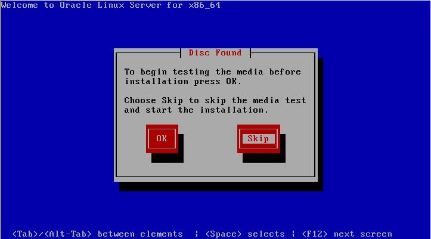

#Linux安装与配置
##安装
这里只是最基本的安装，没有图形界面。当然你也最好选择安装图形界面。 

###虚拟机配置
1. 系统一定要64Bit
2. 内存一般要4GB以上
3. 两块网卡：Host-Only 和 Bridge或NAT
4. 磁盘大小一般要50GB以上


图1

###系统安装
系统安装的步骤大多数操作都是直接下一步，不过需要注意下面几步：
1. 直接选择第一项，安装系统，见图2
2. 检测到磁盘，直接选择跳过，见图3
3. 配置网路，见图4
4. 选择自己所在的时区，见图5
5. 选择安装Server的类型，见图6

图2 

图3

可以选择在这里配置网络，如果hostname和网络没有配置的，后面可以重新配置
图4

我这里选择的时Asia/Shanghai和取消System clock uses UTC选项，因为它会使系统时间慢8个小时，如果你忘记选择了，也没有关系，后面有办法重新配置。

图5

我这里选择的系统类型是Basic Server，这是非常简洁的系统，没有图形界面。不过Linux系统服务器一般都是没有图形界面的。不过，没有Linux基础的人选择Desktop比较好。

图6

最后就是安装过程，如果选择basic Server，一般几分钟就安装完毕了。接着需要重启。

图7

##配置
> 需要root用户或者具有root权限的用户执行

###配置Hostname和IP
1. 配置IP，可以在系统安装时配置，见图4
2. 忘记了配置的，如果是图形界面，可以直接在图形界面上配置，也可以使用下面的脚本运行配置
3. 如果没有图形界面，可以使用下面的脚本

   [changeIP](changeIP.sh)

Host-Only示例：
```bash
[root@infa100 network-scripts]# cat ifcfg-eth0
DEVICE="eth0"
HWADDR="00:0C:29:63:E4:E0"
NM_CONTROLLED="yes"
ONBOOT="yes"
IPADDR=192.168.146.100
```
Bridge示例：
```bash
[root@infa100 network-scripts]# cat ifcfg-eth1
DEVICE="eth1"
HWADDR="00:0C:29:63:E4:EA"
NM_CONTROLLED="yes"
ONBOOT="no"
BOOTPROTO="dhcp"
```

###配置时区
> 正确的时区是很重要的，一个是有些功能，例如HA，需要两个时区一致，不然会导致失败。其次方便根据日期查看日志。

1. 配置时区可以选择在安装时配置，见图5
2. 同配置Hostname和IP一样，可以使用下面的脚本

  [changeTimeZone](changeTimeZone.sh)
    
###关闭桌面,防火墙和SELINUX
一般来说，桌面是很少用到的，关闭桌面，可以节省很多的系统资源。如果哪天要使用它时，请直接使用**startx**命令来启动图形界面。

防火墙，如果你愿意，可以自己写rule。但是作为一个虚拟机服务器，不如直接关闭它更爽快。
 
SELINUX这个也是与安全相关的，也用不到，所以直接关闭。

请使用下面的脚本

  [disableDFS](disableDFS.sh)

 