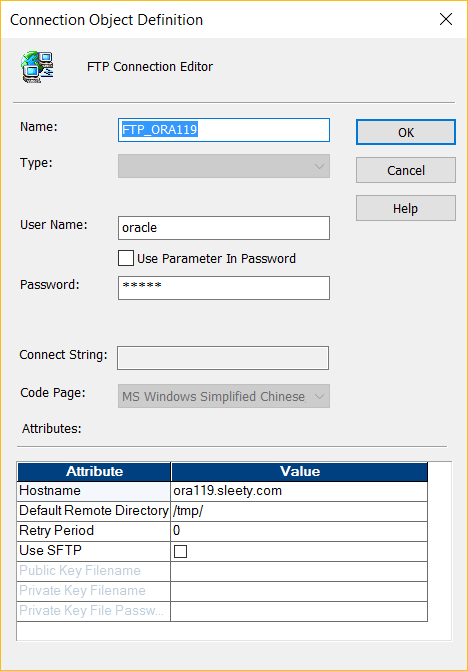
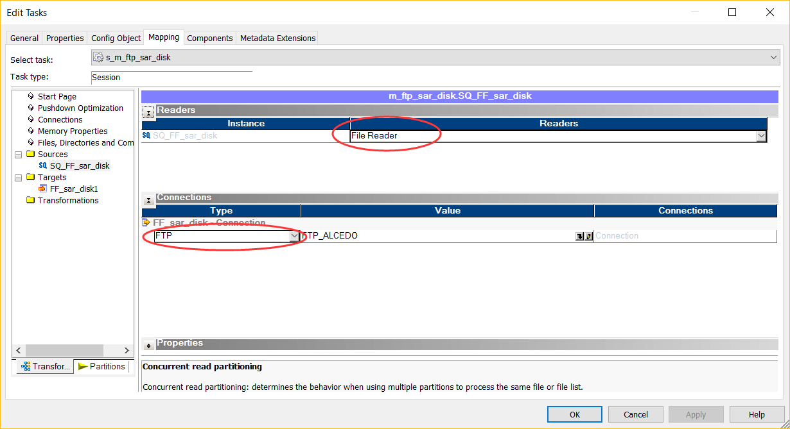
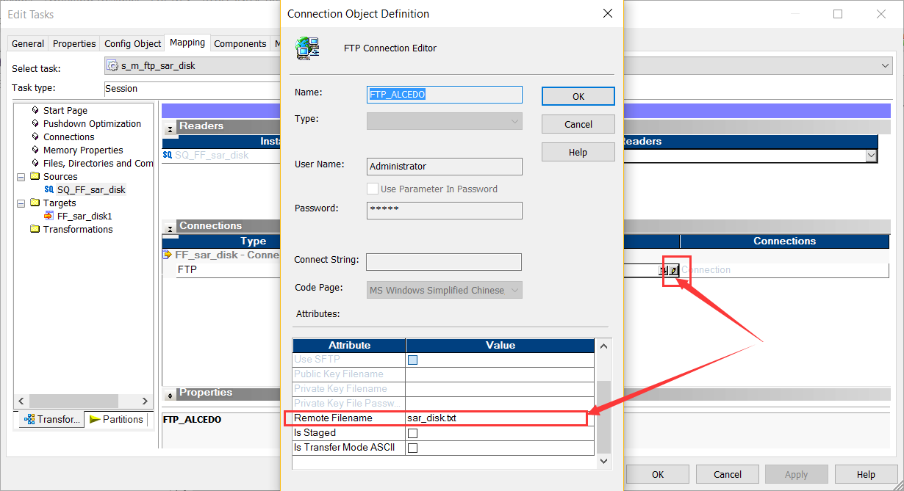
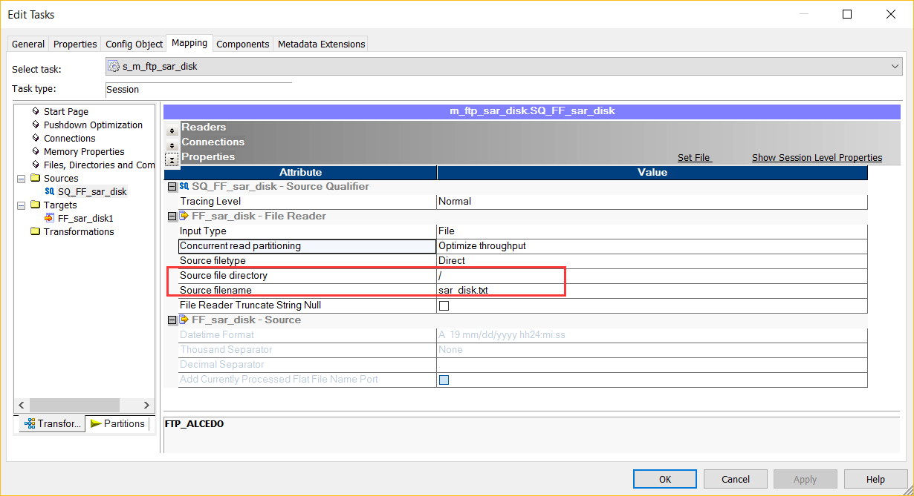
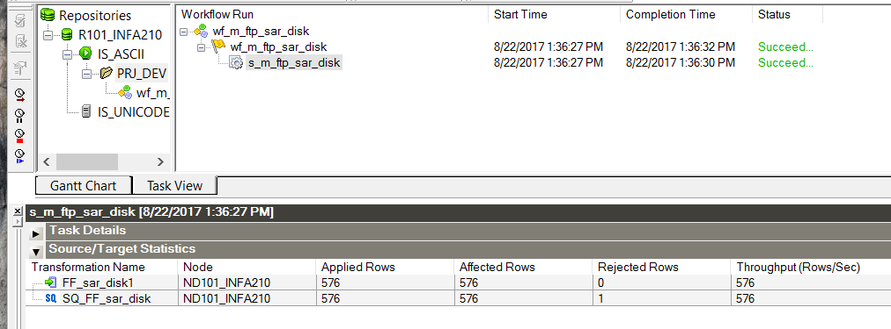

# FTP连接创建和使用
如果没有FTP服务的话，可以参考

## FTP连接创建
FTP连接不管是Windows还是Linux平台，只管FTP上的IP，认证和目录，例如下图Windows和Linux的配置基本都是一样的。

 

## FTP连接的使用
在Session里需要配置即将使用FTP作为源或者目标的属性，这里以FTP为源为例：

#### Readers和Connections
- 设置Readers为File Reader
- Connection里，Type选择FTP，Value选择我们的FTP连接，这里我使用的是windows FTP连接。

#### 重设FTP连接属性
因为FTP连接会重用，那么这里需要指定本Session里使用的连接属性
- 点击铅笔按钮
- 在弹出窗口里填写Remote Filename为具体的文件，这里是sar_disk.txt文件

至于其它的选项，可以参考我们的FTP连接文档

#### 配置Properties
- Source file directory 

    这里我的sar_disk.txt文件在Windows FTP服务的根目录下，所以为“/”

- Source Filename
    
    这里还是填写具体的文件名。

## Workflow测试结果
