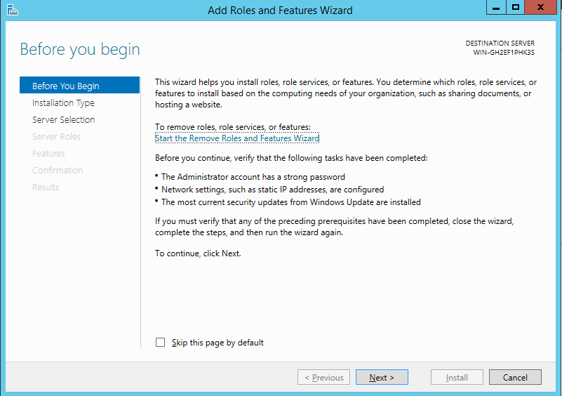
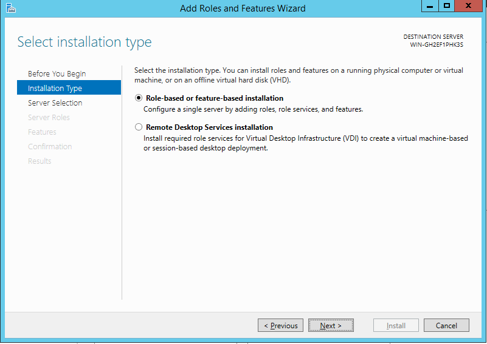
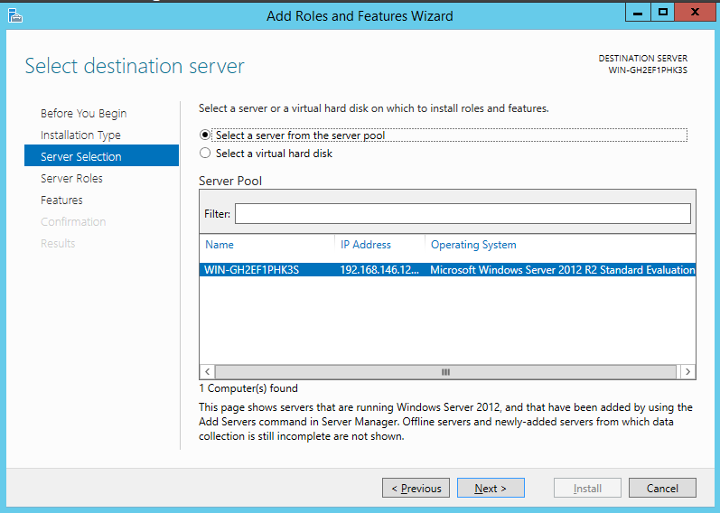
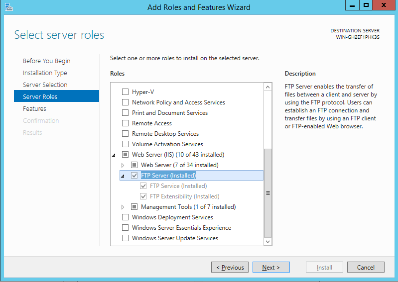
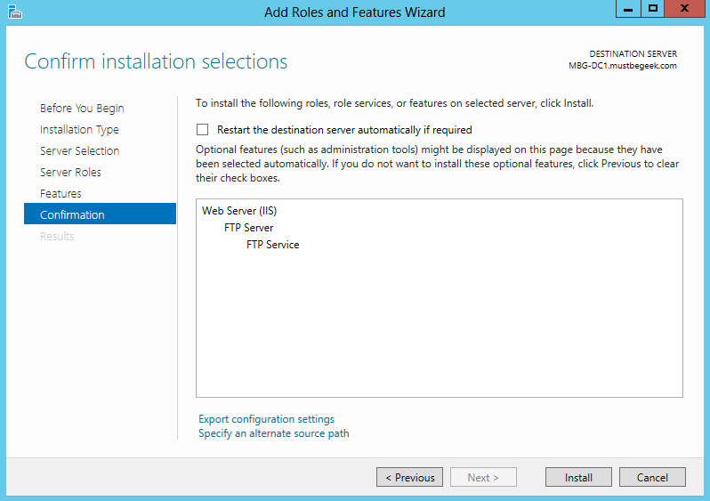
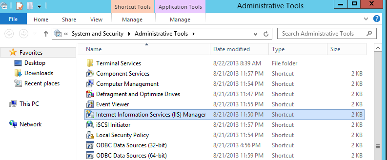

# FTP服务安装和配置
## Linux FTP服务器
#### 安装FTP服务
这里以vsftpd为例，

```bash
[root@ora119 tmp]# yum install -y vsftpd
```

#### 编辑vsftpd.conf配置文件

```bash
[root@ora119 tmp]# vim /etc/vsftpd/vsftpd.conf
########################################################
#|         在我的测试环境，我开启了下面几个主要参         |#
########################################################
# Allow anonymous FTP? (Beware - allowed by default if you comment this out).
anonymous_enable=YES
#
# Uncomment this to allow local users to log in.
local_enable=YES
#
# Uncomment this to enable any form of FTP write command.
write_enable=YES
#
# When "listen" directive is enabled, vsftpd runs in standalone mode and
# listens on IPv4 sockets. This directive cannot be used in conjunction
# with the listen_ipv6 directive.
listen=YES
```

#### 启动vsftpd服务

```bash
########################################################
#| Redhat6/CentOS6等使用service vsftpd start启动       |#
#| Redhat7/CentOS7等使用systemctl start vsftpd启动     |#
########################################################
[root@ora119 tmp]# service vsftpd status
vsftpd is stopped
[root@ora119 tmp]# service vsftpd start
Starting vsftpd for vsftpd:                                [  OK  ]
```

#### 测试ftp服务
从下面的结果可以看出，已经成功连接到ftp服务上了。

```bash
[root@ora119 tmp]# ftp ora119
Trying 192.168.146.119...
Connected to ora119 (192.168.146.119).
220 (vsFTPd 2.2.2)
Name (ora119:root): oracle
331 Please specify the password.
Password:
230 Login successful.
Remote system type is UNIX.
Using binary mode to transfer files.
ftp> 

```

## Windows Server FTP服务器
Windows截图实在是太烦, 捂脸

#### 安装




如果没有安装IIS的话，请先安装IIS服务。这里我已经安装了FTP服务

- FTP Server
- FTP Extensibility



Features这步直接跳过就好了

>> 最后一步引用了他人的截图，可以点击图片连接查看

[](http://www.mustbegeek.com/configure-ftp-server-in-windows-server-2012/) 

#### 配置


最后一步的link [configure-ftp-server-in-windows-server-2012](http://www.mustbegeek.com/configure-ftp-server-in-windows-server-2012/) 里很详细了，直接参考吧。。。

#### 验证FTP服务

```bash
[pwc101@infa210 ~]$ ftp 192.168.146.12
Connected to 192.168.146.12 (192.168.146.12).
220 Microsoft FTP Service
Name (192.168.146.12:pwc101): Administrator
331 Password required
Password:
230 User logged in.
Remote system type is Windows_NT.
ftp> pwd
257 "/" is current directory.
ftp> ls
227 Entering Passive Mode (192,168,146,12,192,50).
125 Data connection already open; Transfer starting.
08-22-17  01:33PM                58939 sar_disk.txt
226 Transfer complete.
ftp> 
```
