# HTTP Transformation调用HTTPS

> 这个主题已经发布在了 https://network.informatica.com/docs/DOC-17472

## 概述
HTTP组件的作用如同使用浏览器访问网址一样，不过有些网站使用加密的手段，将传输内容进行了加密，然后在浏览器会解密成人类可读的内容。不过，在HTTP组件需要手动处理浏览器这一步。

## 获取SSL/TLS证书
获取SSL证书有多种方式，例如使用openssl命令可以获取，这里我推荐使用FireFox浏览器来做。同时，以访问[https://oapi.dingtalk.com/user/get?access_token=wrongToken&userid=noUserID](https://oapi.dingtalk.com/user/get?access_token=wrongToken&userid=noUserID)，为例来说明。

- 访问URL，见图1.

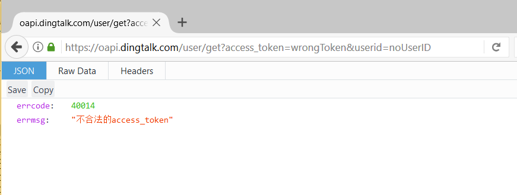
图 1

- 点击URL左边的锁和Show connection detail按钮，见图2

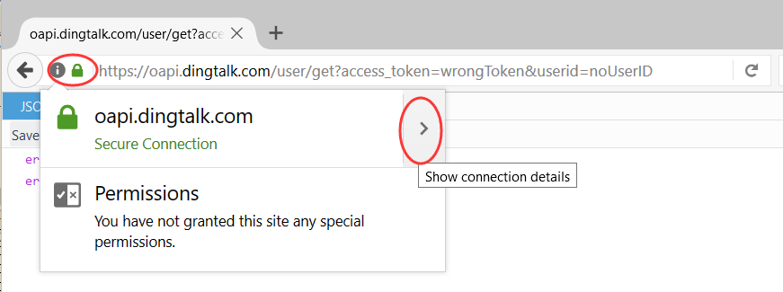 

图 2

- 点击More Information按钮，见图3
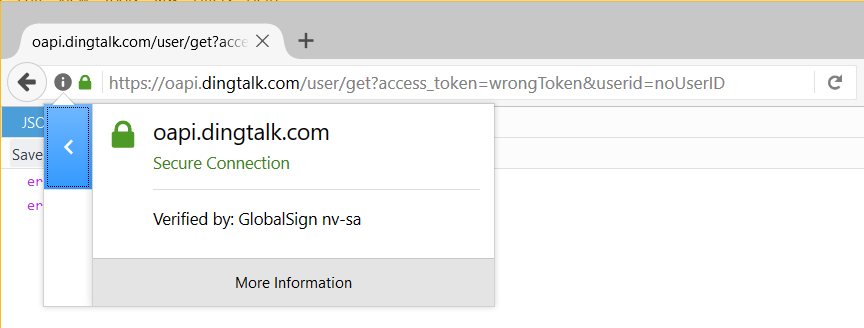

图 3

- 点击Security和View Certificate按钮

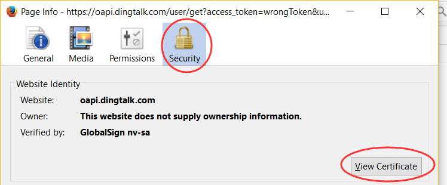

图 4

- 点击Detail和Export按钮

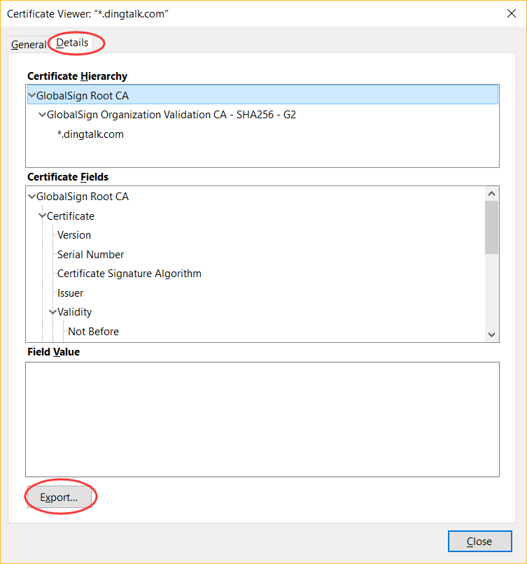

图 5

- 保存证书文件 

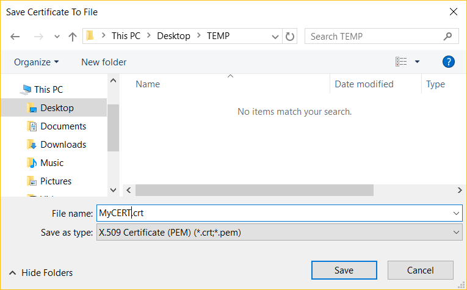

图 6

## 转换SSL/TLS证书为ca-bundle.crt格式
- 将第2步的证书上传到PowerCenter服务器，见图7

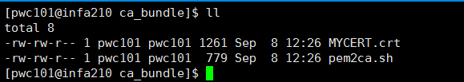

图 7

- 执行脚本将SSL/TLS证书转换成ca-bundle.crt格式，见图8

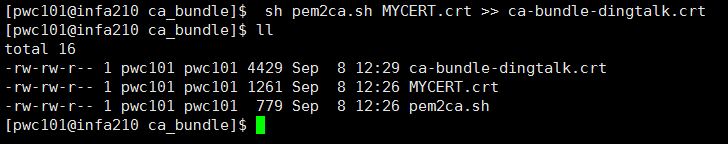 

图 8

脚本请参考 

## 新建http application connection

- 在Workflow Manager Client里点击Connections -> Application -> Http Transformation新建连接

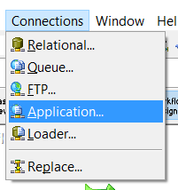

图 9

- 填写连接信息
本例中，用户名和密码为空，所以使用的是INFA自带的占位符

用户名：PmNullUser 

密码：PmNullPasswd

Base URL：https://oapi.dingtalk.com

Domain: dingtalk.com

Trust Certificates File：/home/pwc101/temp/ca_bundle/ca-bundle-dingtalk.crt

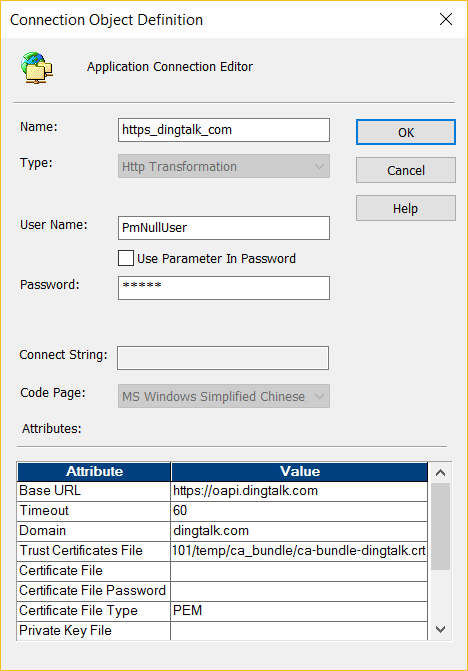
 
图 10

## http transformation属性配置

- Mapping
 
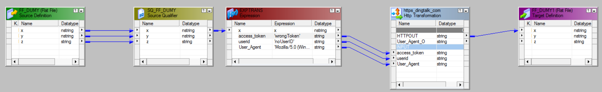

图 11

- HTTP Transformation

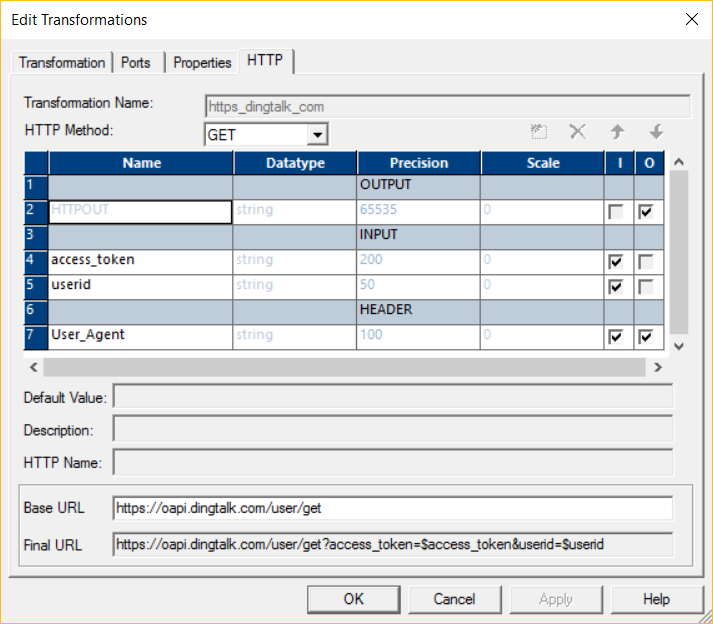

图 12

- 配置Session

点击http transformation，Connections中，选择Application 类型，然后选择对应的Http Application Connection。

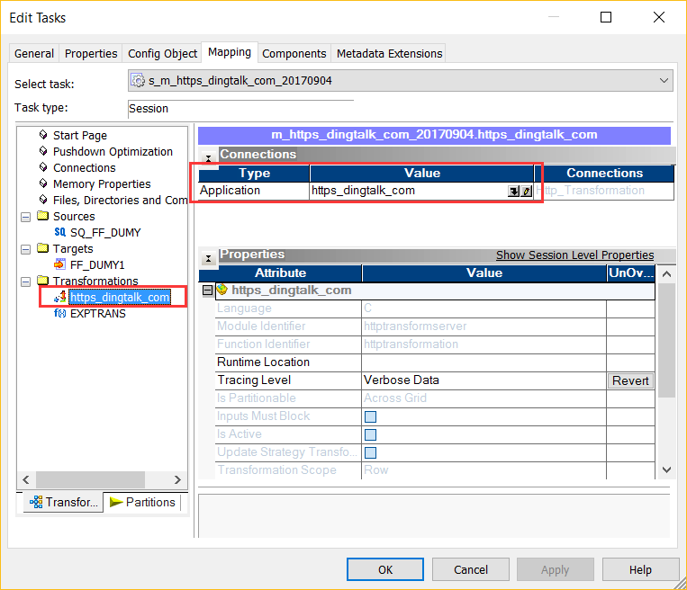
 
图 13

- 保存，运行

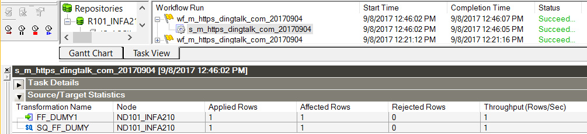

图 14

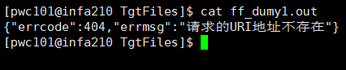
 
图 15

## 常见问题

问：为什么会出现SSL certificate problem: certificate has expired

答：原因是因为SSL certificate证书是有失效日期的，见图16，而且PowerCenter自带的SSL/TLS证书也不是为具体应用的证书而存在的。所以，需要根据不同的站点生成不同的ca-bundle.crt。

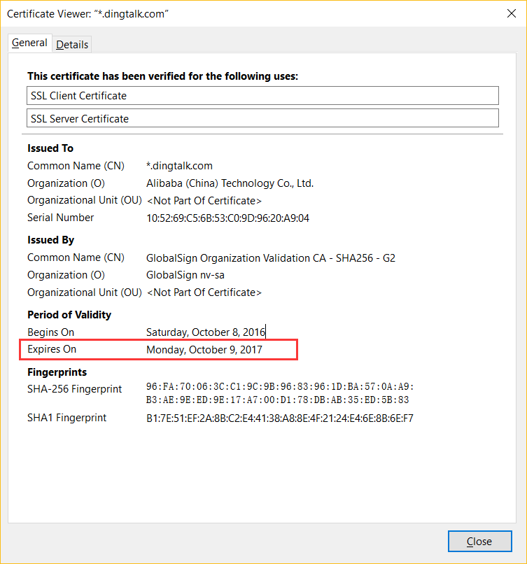

图 16
