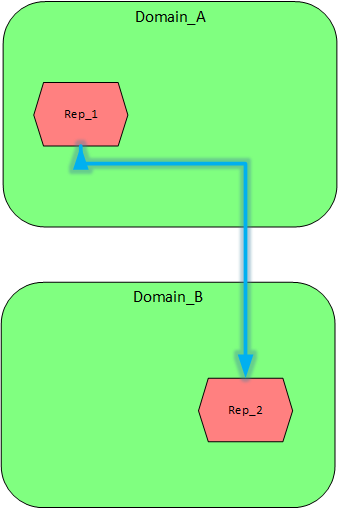

# PowerCenter元数据迁移


在PowerCenter中如何将已经开发好的workflow/mapping等对象迁移到其它Repository？

注意：
> 这里只讨论了相同版本之间的元数据迁移。
>
> 如果是PowerCenter Mercury Platform，这里配置和命令等会有所不同


##场景

所有的场景归纳起来就只有下面两种情形。

- 元数据迁移发生在同一个Domain里的不同Repository上：

 情形1

- 元数据迁移发生在不同的Domain里的Repository上：

 情形2

##迁移方式

### XML文件
不管哪种情形，在PowerCenter都可以通过XML文件方式共享，而且可以不限网络等因素，即可以通过其它途径，例如U盘或者邮件等方式传输。这是最通用的方式。

### 复制粘贴
- 对于情形1

直接在Informatica Repository Client里，将Rep_1和Rep_2在Repository Client里打开，然后将对应的对象直接复制(CTRL+C)，然后点击目标Repository上粘贴(CTRL+V)就可以了。复制粘贴可以使用快捷键也可以点击菜单栏上的Edit里的子选项Copy和Paste。

或者通过把对应的对象加入到Deployment Group里，然后将migration group复制到目标Repository上也可以。

- 对于情形2

需要配置Domain_A和Domain_B里的domains.infa文件，例如

- Domain_A里的domains.infa 

```xml

<?xml version="1.0" encoding="UTF-8"?>

<Portals xmlns:logservice="http://www.informatica.com/pcsf/logservice" xmlns:domainservice="http://www.informatica.com/pcsf/domainservice" xmlns:domainconfigservice="http://www.informatica.com/pcsf/domainconfigservice" xmlns:alertservice="http://www.informatica.com/pcsf/alertservice" xmlns:usermanagement="http://www.informatica.com/pcsf/usermanagement" xmlns:webserviceshub="http://www.informatica.com/pcsf/webserviceshub" xmlns:xsi="http://www.w3.org/2001/XMLSchema-instance" xmlns:domainbackup="http://www.informatica.com/pcsf/domainbackup" xmlns:xsd="http://www.w3.org/2001/XMLSchema" xmlns:licenseusage="http://www.informatica.com/pcsf/licenseusage" xmlns:metadata="http://www.informatica.com/pcsf/metadata" xmlns:common="http://www.informatica.com/pcsf/common"  xsi:type="common:PCSFVector"  objVersion="1.1.19">

<vector xsi:type="domainservice:Portals"  objVersion="1.1.19">

<domainName>Domain_A</domainName>

<address xsi:type="metadata:NodeRef"  objVersion="1.1.19">

<host>A.sleety.com</host>

<port>6005</port>

</address>

<tlsEnabled>false</tlsEnabled>

<kerberosEnabled>false</kerberosEnabled>

</vector>

</Portals>

```

- Domain_B里的domains.infa

```xml

<?xml version="1.0" encoding="UTF-8"?>

<Portals xmlns:logservice="http://www.informatica.com/pcsf/logservice" xmlns:domainservice="http://www.informatica.com/pcsf/domainservice" xmlns:domainconfigservice="http://www.informatica.com/pcsf/domainconfigservice" xmlns:alertservice="http://www.informatica.com/pcsf/alertservice" xmlns:usermanagement="http://www.informatica.com/pcsf/usermanagement" xmlns:webserviceshub="http://www.informatica.com/pcsf/webserviceshub" xmlns:xsi="http://www.w3.org/2001/XMLSchema-instance" xmlns:domainbackup="http://www.informatica.com/pcsf/domainbackup" xmlns:xsd="http://www.w3.org/2001/XMLSchema" xmlns:licenseusage="http://www.informatica.com/pcsf/licenseusage" xmlns:metadata="http://www.informatica.com/pcsf/metadata" xmlns:common="http://www.informatica.com/pcsf/common"  xsi:type="common:PCSFVector"  objVersion="1.1.19">

<vector xsi:type="domainservice:Portals"  objVersion="1.1.19">

<domainName>Domain_B</domainName>

<address xsi:type="metadata:NodeRef"  objVersion="1.1.19">

<host>B.sleety.com</host>

<port>6005</port>

</address>

<tlsEnabled>false</tlsEnabled>

<kerberosEnabled>false</kerberosEnabled>

</vector>

</Portals>

```

- 合并domains.infa信息

如果需要Domain_A和Domain_B两个Domain能够实现数据迁移，需要将两个dominas.infa里的vector里的信息相互追加即可。也就是说，修改之后的domains.infa信息如下

```xml

<?xml version="1.0" encoding="UTF-8"?>

<Portals xmlns:logservice="http://www.informatica.com/pcsf/logservice" xmlns:domainservice="http://www.informatica.com/pcsf/domainservice" xmlns:domainconfigservice="http://www.informatica.com/pcsf/domainconfigservice" xmlns:alertservice="http://www.informatica.com/pcsf/alertservice" xmlns:usermanagement="http://www.informatica.com/pcsf/usermanagement" xmlns:webserviceshub="http://www.informatica.com/pcsf/webserviceshub" xmlns:xsi="http://www.w3.org/2001/XMLSchema-instance" xmlns:domainbackup="http://www.informatica.com/pcsf/domainbackup" xmlns:xsd="http://www.w3.org/2001/XMLSchema" xmlns:licenseusage="http://www.informatica.com/pcsf/licenseusage" xmlns:metadata="http://www.informatica.com/pcsf/metadata" xmlns:common="http://www.informatica.com/pcsf/common"  xsi:type="common:PCSFVector"  objVersion="1.1.19">

<vector xsi:type="domainservice:Portals"  objVersion="1.1.19">

<domainName>Domain_A</domainName>

<address xsi:type="metadata:NodeRef"  objVersion="1.1.19">

<host>A.sleety.com</host>

<port>6005</port>

</address>

<tlsEnabled>false</tlsEnabled>

<kerberosEnabled>false</kerberosEnabled>

</vector>

<vector xsi:type="domainservice:Portals"  objVersion="1.1.19">

<domainName>Domain_B</domainName>

<address xsi:type="metadata:NodeRef"  objVersion="1.1.19">

<host>B.sleety.com</host>

<port>6005</port>

</address>

<tlsEnabled>false</tlsEnabled>

<kerberosEnabled>false</kerberosEnabled>

</vector>

</Portals>

```


### 命令方式

Informatica PowerCenter支持命令方式实现元数据迁移。

如果是XML文件，可以查看pmrep命令

> ObjectImport 

> ObjectExport

如果是Deployment Group方式，也需要**复制粘贴**里提到的修改domains.infa文件。
可以查看pmrep命令

> DeployDeploymentGroup


#### 控制文件

这些命令都需要一个控制文件，你可以通过在**复制粘贴**里手动做迁移，默认会在客户端安装目录<installationPath>\clients\PowerCenterClient\client\bin下生成一个默认文件。

另外，可以查看帮助文档 Command Reference -> Working with pmrep Files


### Folder/Repository级别的恢复

如果是一个全新的Foder或者Repository，需要将其它的Folder或者Repository的对象恢复过来，那么可以采取这种方式。

