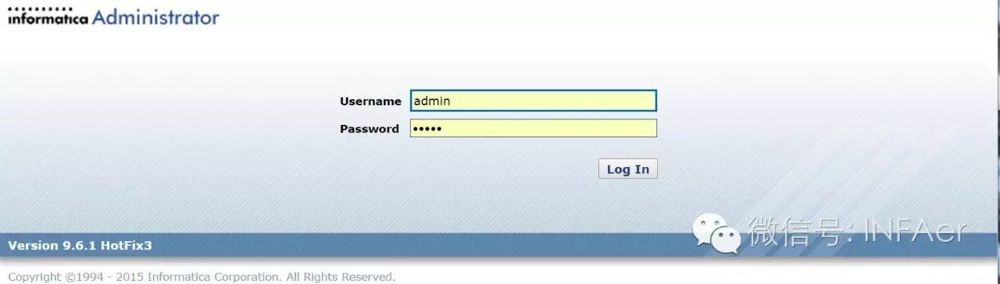

#INFA 管理

**Administrator**的日常工作，其实是非常繁杂的，其中包括**PowerCenter**的安装，服务管理与维护，迁移与升级......

##安装与配置
这里以**Oracle Linux6.1**操作系统，**Oracle 11gR2**数据库和**PWC 961HF3**为例，图文并茂地搭建本地测试环境。切记在生产环境一定要参考**PAM文档**

> 注：Oracle Linux 并没有在PAM文档中，这里只是测试环境，如果有条件的，请使用Redhat等在PAM支持列表的里的操作系统。

###Linux
######[Linux安装与配置](LINUX/README.md)

###PowerCenter
######[PWC安装与配置](PWC/README.md)
######[元数据迁移](PWC/MigrationA.md)
######[PowerCenter分类](PWC/PWCTypes.md)
######[FTP服务的创建](PWC/FTPServices.md)
######[FTP连接创建和使用](PWC/FTPConnection.md)
######[HTTP Transformation调用HTTPS](PWC/HttpTransformation_Https_URL.md)
######[Informatica repository manager encountered an improper argument](PWC/REP_MANAGER_CLIENT_ENCOUNTERED_AN_IMPROPER_ARGUMENT.md)

###DDM
######[DDM换License](DDM/ChangeLicense.md)

###Cloud
######[INFA Cloud注册与Secure Agent安装配置](CLOUD/README.md)
######[创建连接](CLOUD/Connection.md)

###BDM
######[BDM概要](BDM/README.md)
######[Mercury Platform元数据迁移](BDM/DeploymentIssues.md)
######[Developer客户端设置为英文](BDM/Developer_Language_EN.md)

###ActiveVOS
ActiveVOS是一个BPM软件，它可以和MDM集成，也可以单独使用。

######[Install ActiveVOS - JBoss in Linux](MDM/ActiveVOS_JBoss_Linux_Installation.md)
