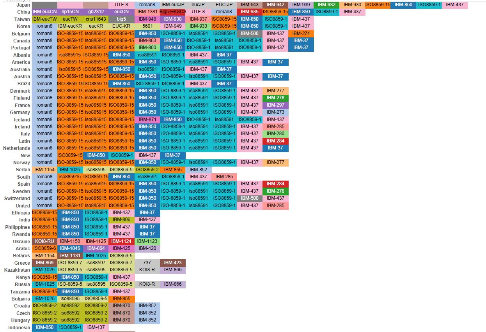
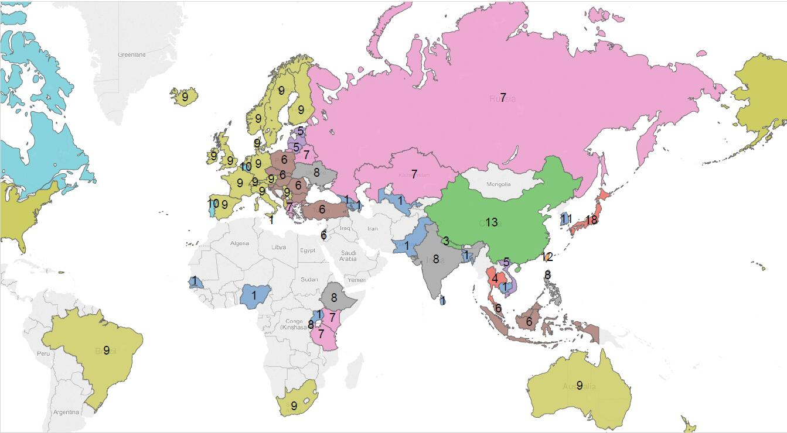

#字符集自述
我叫字符集，我也不知道怎么叫这么挫的名字，听起好邪恶，其实我应该叫做屌炸天！

我不吹牛，原因且听我慢慢道来，话说有一群NB的歪果仁搞出了计算机这么一个家伙，可是这个家伙也真够笨的，只能处理数字，而且还只能是0和1，而且这个家伙幸运数字是8，什么都是8个一排，见注1。

而歪果仁他们都是什么abcd的，怎么把0和1和abcd联系起来呢？关键时刻，我就闪亮登场了，
我把字符和0和1组成的数字一一对应起来了，人们不需要看着0和1猜是什么字符了，也不需要把字符拆成0和1存在古板的计算机里。举个栗子, 
小明说，我在200030这里，你来找我嘛。
> 200030是个邮政编码，可以是你知道它是哪个地方吗？看来不能愉快的聊天了。

如果小明说，我在上海市徐汇区，这样还可以做朋友。

所以，字符集编码就是使用数字把字符一一对应。就像邮政编码和中国的镇是一一对应的，看到邮政编码就能找到唯一具体的地方；看到这个地方，就有唯一的邮政编码。

此处应该有掌声的！

 图1, 见注2

你看嘛，我的家族成员众多，全世界都有。而且你也可以看看图2。

 图2

>注1： 一个字节有8bits

>注2： 此图字符集统计不完全，鉴于图片太长，所以这里指显示部分国家。 关于图1和图2，是Tableau画出的图表。数据是从网上扒下来的，太脏了，做完这个图表后，发现一份符合要求而且干净的数据是多么重要。