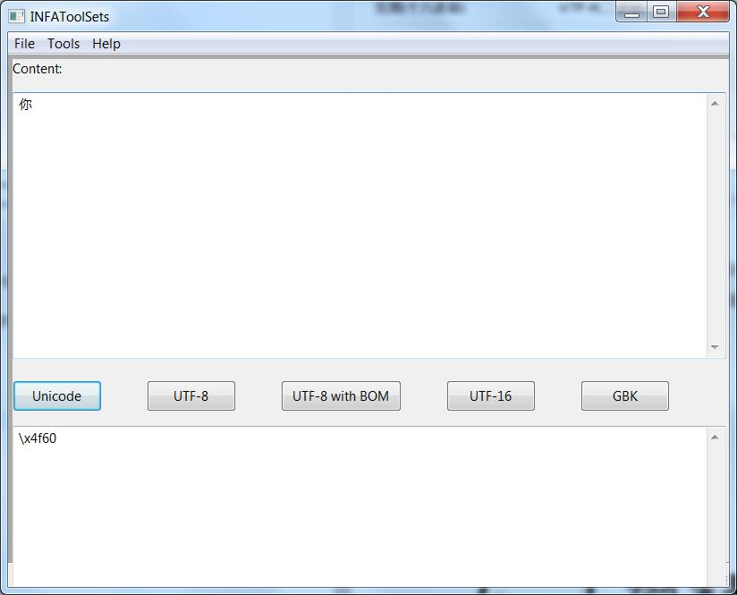
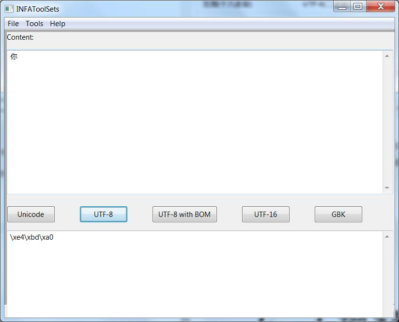

#UTF-8
话说Unicode腾空出世之后，大家纷纷奔走相告，好一片繁荣。

可是每个Unicode都要4个字节来存储，长胖了有没有，而且不能和ASCII美眉玩耍了！是可忍，叔不能忍！

又不想长那么胖，而且还要获得ASCII美眉的芳心，怎么办？

灵机一动，要想和ASCII美眉套近乎，就得保持0xxxxxxx不变，而又不比Unicode差的话，就得要表示额外的字符，那么，超过ASCII编码的字符，我把它给拆分成多个部分存放在多个字节里。机智如我啊！

请看下表的表示方法。

| 范围(十六进制) | UTF-8(二进制) |
| -- | -- |
| 0000 0000-0000 007F | 0xxxxxxx | 
| 0000 0080-0000 07FF | 110xxxxx 10xxxxxx | 
| 0000 0800-0000 FFFF | 1110xxxx 10xxxxxx 10xxxxxx |
| 0001 0000-0010 FFFF | 11110xxx 10xxxxxx 10xxxxxx 10xxxxxx |
| 0020 0000-03FF FFFF | 111110xx 10xxxxxx 10xxxxxx 10xxxxxx 10xxxxxx |
| 0400 0000-7FFF FFFF | 1111110x 10xxxxxx 10xxxxxx 10xxxxxx 10xxxxxx 10xxxxxx |

上表表示了字符十六进制的范围，与UTF-8的二进制表示格式。 

其中第一字节中第一个0前面有几个1就表示需要多少字节。而后面的每个字节都以10开头。

例如，表中的最后一行，第一个字节是**1111110x**，其中第一个0前面有6个1，那么就表示一共需要6个字节。而后面的5个字节都是以**10**开头的。

你，这个字，Unicode编码是\x4f60

而UTF-8的编码是\xe4\xbd\xa0

我们来看看这两个的二进制

其中\x4f60为100111101100000

\xe4\xbd\xa0为111001001011110110100000。我们可以看出来，你使用UTF-8存储需要3个字节(111,3个1)。拆分成三个部分：

|UTF-8部分 | 去除头部信息| 注释 |
| -- | -- | -- |
|11100100 | 0100 | 去掉1110部分 |
|10111101 | 111101 | 去掉10部分 |
|10100000 | 100000| 去掉10部分 |

那么将去除头部信息的数字组合起来，0100 111101 100000。而首位的0是可以去掉的。所以就得到了100111101100000。
就和\x4f60的二进制一模一样。

