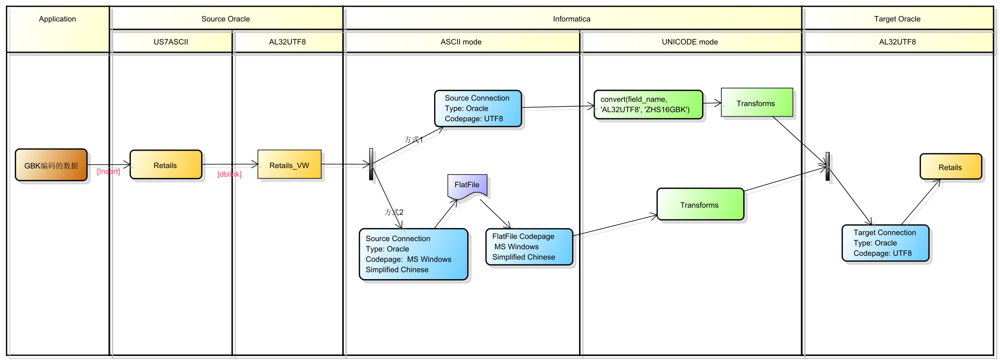
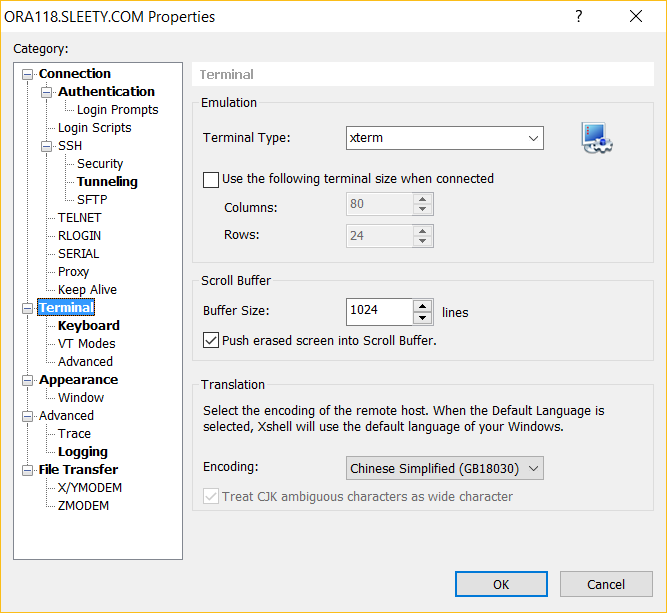
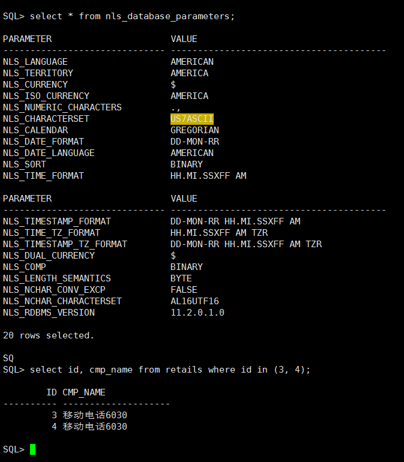
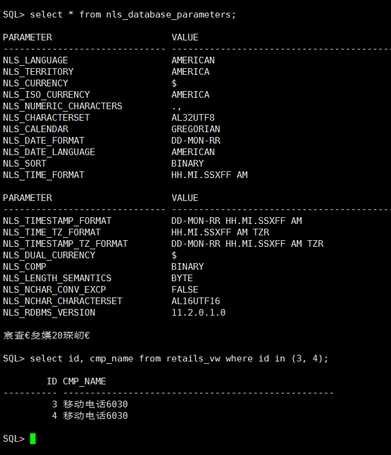
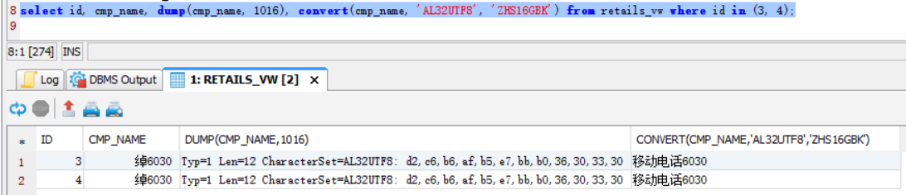

# 编码处理实战

## 背景
1. 上层应用将数据以GBK编码的形式写入到了oracle US7ASCII字符集编码里
2. 然后在使用DBLINK，在AL32UTF8字符集编码里创建视图引用第1步的表。
3. 抽取AL32UTF8里视图的数据，然后处理，写入到AL32UTF8的数据库里

思路和解决方案请看下图
> 点击下图查看高清无码版
> 

## 对比
| 方式 | 类型 | 优点 | 缺点 |
| -- | -- | -- | -- |
|方式1|利用Oracle Convert函数解码 | 理解容易，直接 |每个需要转码的字段都需要调用这个函数，麻烦，同时这些操作需要oracle来完成|
|方式2| 利用ASCII不转码特性| 纯INFA解决，适用性广| 不太好理解，过程有点复杂，同时需要落地临时文件|

## 可能关心的具体的处理细节

> 注意查看工具的编码设置，例如我这里是Xshell的encoding设置： GBK or GB18030
>

- 数据是从应用以GBK编码的方式写入到了US7ASCII的Oracle retails表中，

- 然后在AL32UTF8的Oracle数据库中以dblink的方式创建了一个view，即retails_vw。

- 在DBVis上查看结果如下

- 以ASCII模式抽取到文本文件的输出结果

## 思考
背景里的第2步如果不存在，即直接从US7ASCII里抽取数据，如何处理数据？