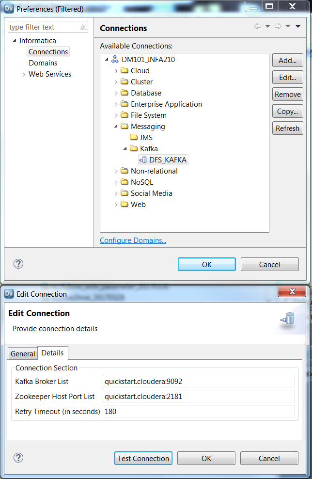
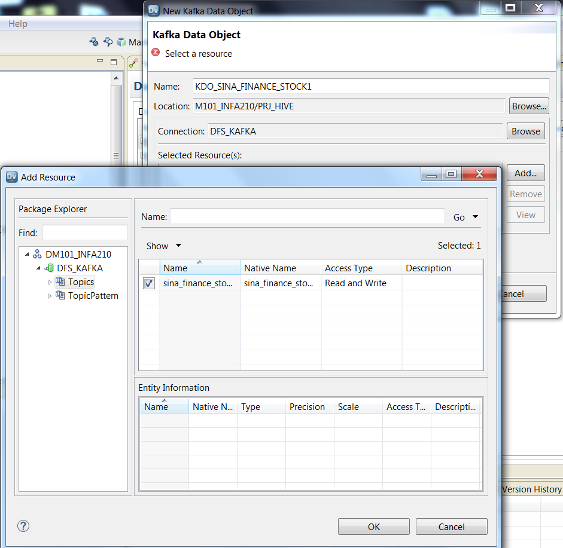
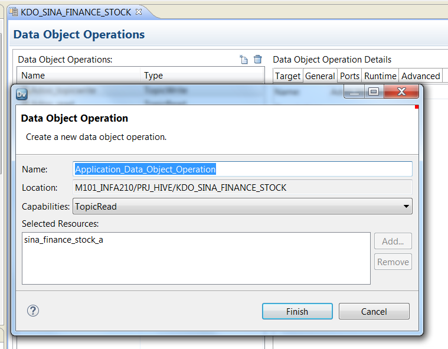
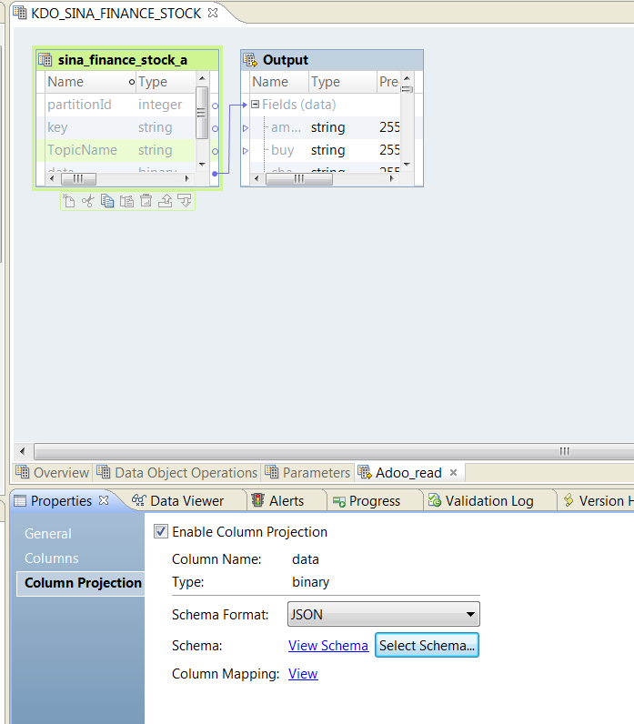
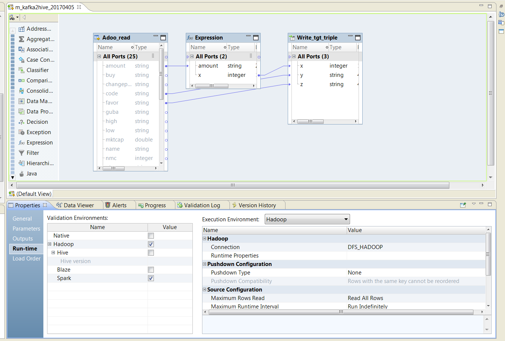
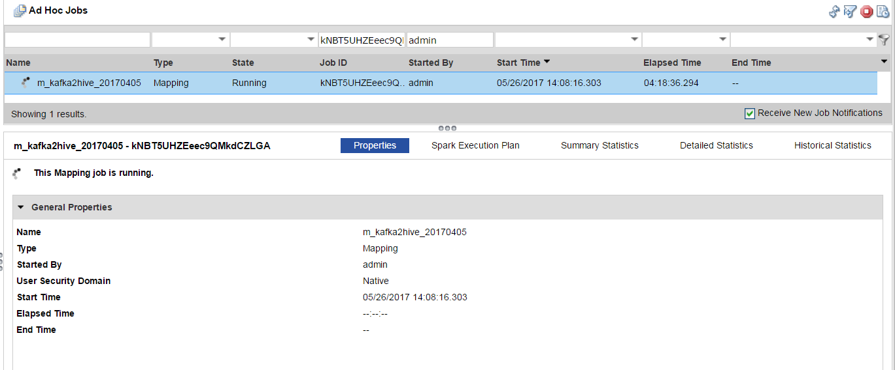
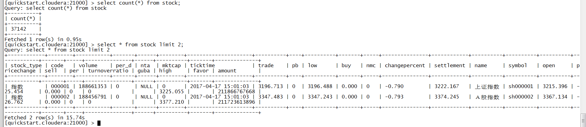

# BDM接入KAFKA

这篇出现时间有点突兀，可能在讲了一些BDM的基础之后，再看会好多了。

> 可能内容有点长，会引起不适，可以查看简短版

## 简短版

> 1. Kafka是消息队列，在BDM中只有Spark引擎支持

> 2. 新建Kafka连接，并导入对应的Resource

> 3. 配置Kafka Read Operation或Write Operation信息

> 4. 设计mapping

## 示例环境
- PowerCenter 10.1.1
- BDM 10.1.1
- Cloudera 5.8

## 新建KAFKA连接

## 导入Resource

## 配置Read Operation或Write Operation

在配置Read Operation或Write Operation之前，需要根据实际情况新建Read Operation和Write Operation

这里以Read Operation为例：

双击新建的Read Operation, 来配置Read Operation。
如下图所示，在Column Projection里，选中Enable Column Project，然后选择正确的Schema Format，例如，我这里是JSON，然后点击Select Schema，将示例json文件选中即可。其它格式，请选择正确的Schema文件。

## 设计mapping

这里只是一个测试示例，注意一点
> Run-Time里选择Spark模式

## 运行测试mapping

验证输出结果：

## 注意
- 现在只支持KAFKA三种模式: XML,JSON和Avro
- 只能运行在Spark模式