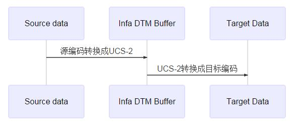

# Informatica Data Movement Mode
每个workflow都会指定一个集成服务来运行，而每个集成服务都必须指定一个DataMovementMode。不过简单地是，DataMovementMode只有两个选择
- ASCII
- Unicode

### 在哪里设置集成服务的DataMovementMode
需要登录到Administrator Console里，选择集成服务，在**PowerCenter Integration Service Properites** 栏里，就可以看到DataMovementMode,你可以编辑它，选择需要的模式。

### 有什么作用
其实这个设置，很多人都没有太注意。但是这个选项确实有很大的影响。
- 是否转码

**ASCII不转码，UNICODE会转码**

ASCII模式是garbage-in，garbage-out模式，就是数据怎么进来的，就怎么出去，乱码等等问题，都不管，比较任性。

UNICODE模式

前面写了很多关于字符集编码的东西，在这里才能真正体现。

