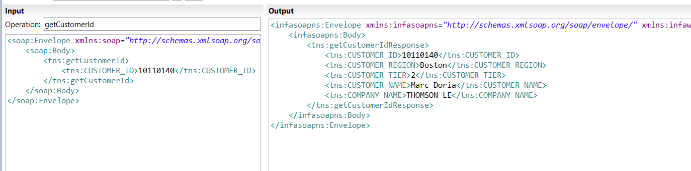

# 使用Web Service实现列级别的显示

在某些场景，数据库中的某些表的字段是比较敏感的，有些级别的客户是没有权限来查看的。
所以这里就以这种场景来实现一个小小的示例。

## RESTful权限控制系统
我设计了一个简单的权限RESTful服务，根据CUSTOMER_ID来返回客户的Level。例如:

另外，后面测试的Level 和CUSTOMER_ID列表[权限级别：Level 1 < Level 2 < Level 3]：

| Level | CUSTOMER_ID |
|-------|-------------|
|     1 |    10110140 |
|     2 |    10111996 |
|     3 |    10112047 |

为了更好的理解整个过程，这里我直接上mapping。

## Mapping

| 组件名                  | 功能或者说明                                |
|-------------------------|---------------------------------------------|
| Input                   | 获得输入CUSTOMER_ID                         |
| Exp_convert_customer_id | 将 CUSTOMER_ID类型的string类型转换为int类型 |
| Rest_get_level          | 从第1步的RESTful服务获取用户的Level等级     |
| Lookup_Customer         | 从Customer逻辑表中查找CUSTOMER_ID的信息     |
| Router_Filter_Level     | 根据Level返回对应的列                       |
| Union_All_Datasets      | 将所有的结果集汇总                          |
| Output                  | 输出Web Service结果                         |

其中Ccustomer表是一张虚拟逻辑表，它可以是由很多张表或者文本文件等组成的一个表。

## 测试

| Level | CUSTOMER_ID | 截图        |
|-------|-------------|-------------|
|     1 |    10110140 |  |
|     2 |    10111996 |  |
|     3 |    10112047 |  |

## Resources
- 权限控制系统的程序
这个程序只是一个简单的Python Flask程序。

Mapping XML和权限控制系统的程序Privs_Based_Fields.zip放到了resources目录。

另外，Informatica的版本是10.2.1

