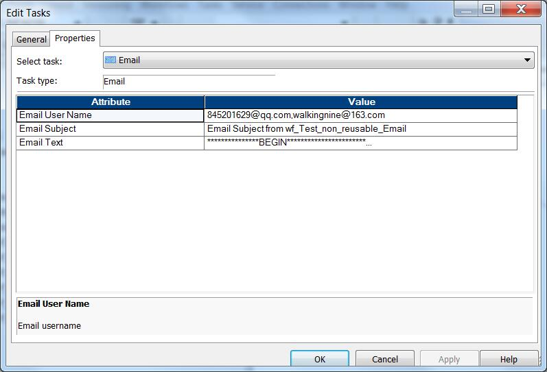

#rmail

为了在 **Unix** 或者 **Unix-like** 的操作系统上，发送邮件，需要配置 **rmail** 或者 **sendmail**。这里我引用官方文档：
> ######Configuring Email on UNIX
> The Integration Service uses rmail to send email. On SUSE Linux Enterprise Server 11 (64-bit), the Integration Service uses sendmail. To send email, the user who starts Informatica services must have the rmail or sendmail tool installed in the path. 
> If you want to send email to more than one person, separate the email address entries with a comma. Do not put spaces between addresses. 

理想情况下，我们或者有人帮我们配置好**ramil**或者**sendmail**；可以现实是残酷的，百度或者Google，做了很久，依旧没有配置成功。

这里我写了一个Python脚本，用来实现**rmail**或者**sendmail**的功能，这样就可以使用**PowerCenter**来发送邮件了。其中两个文件：
* [rmail_conf.xml](rmail_conf.xml) 
	* rmail的配置文件
* [rmail](rmail)
	* rmail的执行文件

##配置
执行下面三步:
- 请将这两个文件放到一个目录里，并**PowerCenter用户**具有对文件读和执行的权限和rmail_conf.xml文件读的权限。
```Bash
[pwc961@infa210 tools]$ pwd
/home/pwc961/tools
[pwc961@infa210 tools]$ chmod u+rx rmail
[pwc961@infa210 tools]$ chmod u+r rmail_conf.xml
[pwc961@infa210 tools]$ ll rmail*
-rwxrw-r-- 1 pwc961 pwc961 9068 May 19 14:47 rmail
-rw-rw-r-- 1 pwc961 pwc961  897 May 19 11:54 rmail_conf.xml
```
- 在profile文件里设置环境变量
```Bash
export PATH=/home/pwc961/tools:$PATH
```

- 生效环境变量，重启Infa PWC服务，
```Bash
[pwc961@infa210 tools]$ source ~/.bash_profile 
[pwc961@infa210 tools]$ $INFA_HOME/tomcat/bin/infaservice.sh startup
```

##测试结果
###Workflow 
这里只是简单测试email task。如果你把Email Task放到Session里，还可以添加附件。

[wf_Test_non_reusable_Email.XML](wf_Test_non_reusable_Email.XML)

Email Task配置



###运行结果


----------
>注1: Python在预安装在了Linux系统上。现在这个版本的在Python2.7以下的版本有点问题。不过你可以修改第一行代码，使用具体的某个Python版本: 例如，下面我使用自己的Python 2.7
> `#!/home/pwc961/tools/Python/Python-2.7.11/bin/python`
> 
> 注2： 这里演示的是QQ邮箱，请参考[QQ邮箱怎么开启smtp服务](http://service.mail.qq.com/cgi-bin/help?subtype=1&no=166&id=28)  以及 [其它工具怎么使用QQ邮箱收发邮件](http://service.mail.qq.com/cgi-bin/help?subtype=1&&id=28&&no=371)
> 
> 注3：如果使用QQ之类的邮箱发送邮件，需要保证PowerCenter服务器能够连接外网
> 
> 注4: 在profile里设置环境变量时，注意顺序。如果$PATH在/home/pwc961/tools可能会出现rmail脚本不会生效
> 