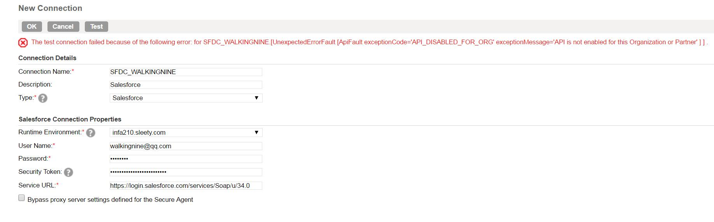
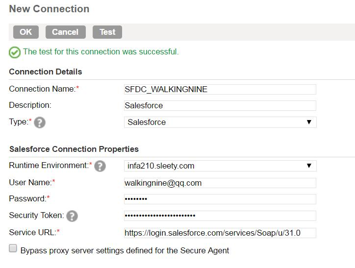
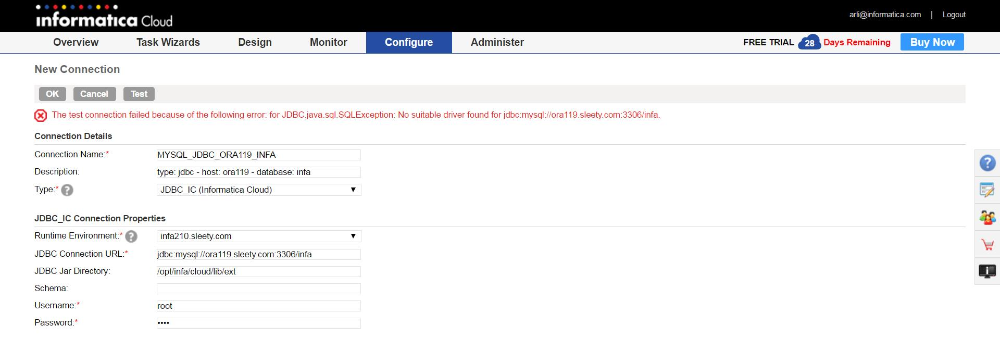

#Cloud FAQ

##Salesforce
###Q
######Key Words: API_DISABLED_FOR_ORG

```
The test connection failed because of the following error: for SFDC_WALKINGNINE.[UnexpectedErrorFault [ApiFault exceptionCode='API_DISABLED_FOR_ORG' exceptionMessage='API is not enabled for this Organization or Partner' ] ] .
```


###A
将Service URL从https://login.salesforce.com/services/Soap/u/34.0 改成https://login.salesforce.com/services/Soap/u/31.0 解决问题




##MySQL JDBC
###Q
######Key Words: MySQL JDBC
Jar包已经上传到了指定目录中，在使用MySQL JDBC连接时，出现如下错误。



###A


