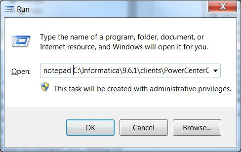

#DLL name entry missing

##Q:
在Designer里导入Postgresql或者MySQL等Informatica原生不支持的ODBC驱动时，报如下错误


```bash
---------------------------
Designer
---------------------------
DLL name entry missing from C:\Informatica\9.6.1\clients\PowerCenterClient\client\bin\powrmart.ini
Section = ODBCDLL
Entry = PostgreSQL
---------------------------
OK   
---------------------------
```

##A
作为一个有追求的INFAer，决定不能忍受这个问题！

在cmd里使用
```bash
notepad C:\Informatica\9.6.1\clients\PowerCenterClient\client\bin\powrmart.ini
``` 



