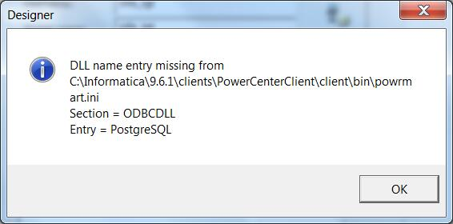
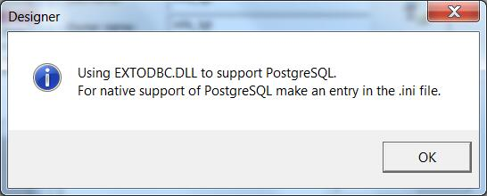
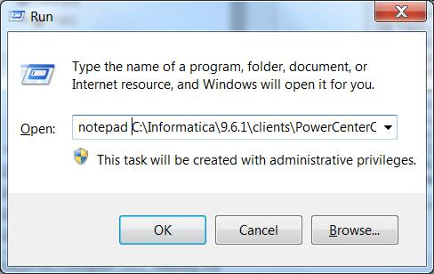
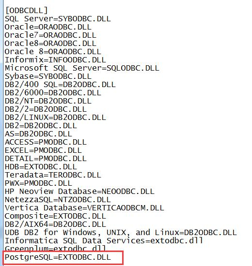

#DLL name entry missing
##Q:
在Designer里导入**Postgresql**或者**MySQL**等Informatica原生不支持的ODBC驱动(DataDirect)时，报如下错误



```bash
---------------------------
Designer
---------------------------
DLL name entry missing from C:\Informatica\9.6.1\clients\PowerCenterClient\client\bin\powrmart.ini
Section = ODBCDLL
Entry = PostgreSQL
---------------------------
OK   
---------------------------
```

##A
作为一个有追求的INFAer，决定不能忍受这个问题！

通过点击OK，你可以获得相关的帮助，例如下图显示，在.ini文件里，添加EXTODBC.DLL来支持PostgreSQL



在cmd里使用
```bash
notepad C:\Informatica\9.6.1\clients\PowerCenterClient\client\bin\powrmart.ini
``` 


在[ODBCDLL]里添加一条记录： **PostgreSQL=EXTODBC.DLL**， 如下图：



然后重新打开Designer，就不会出现这个问题了。

对于MySQL，请使用**MySQL=EXTODBC.DLL**即可。