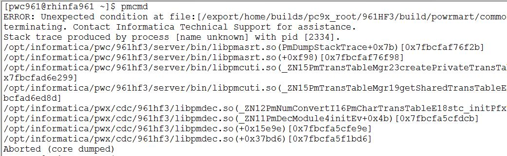

#Command Core Dumped 
##Q
为什么**INFA**的服务都运行地好好的，而执行命令时，却报错了。此时，内心是崩溃的:sob: :sob: :sob:


```bash
[pwc961@rhinfa961 ~]$ pmcmd 
ERROR: Unexpected condition at file:[/export/home/builds/pc9x_root/961HF3/build/powrmart/common/cutils/pmtranstb.cpp] line:[148]. Application terminating. Contact Informatica Technical Support for assistance.
Stack trace produced by process [name unknown] with pid [2369].
/opt/informatica/pwc/961hf3/server/bin/libpmasrt.so(PmDumpStackTrace+0x7b)[0x7f542b167f2b]
/opt/informatica/pwc/961hf3/server/bin/libpmasrt.so(+0xf98)[0x7f542b167f98]
/opt/informatica/pwc/961hf3/server/bin/libpmcuti.so(_ZN15PmTransTableMgr23createPrivateTransTableERPN16PmTransTableBase12InitInfoBaseE+0x49)[0x7f542af5f299]
/opt/informatica/pwc/961hf3/server/bin/libpmcuti.so(_ZN15PmTransTableMgr19getSharedTransTableERPN16PmTransTableBase12InitInfoBaseE+0x11d)[0x7f542af5fd8d]
/opt/informatica/pwx/cdc/961hf3/libpmdec.so(_ZN12PmNumConvertI16PmCharTransTableE18stc_initPfxTransTbEv+0x137)[0x7f542a7c4f87]
/opt/informatica/pwx/cdc/961hf3/libpmdec.so(_ZN11PmDecModule4initEv+0x4b)[0x7f542a7c0dcb]
/opt/informatica/pwx/cdc/961hf3/libpmdec.so(+0x15e9e)[0x7f542a7c0e9e]
/opt/informatica/pwx/cdc/961hf3/libpmdec.so(+0x37bd6)[0x7f542a7e2bd6]
Aborted (core dumped)
```

##A
###这种问题一般出在了环境变量的设置上。
这里以**Linux**为例，Library的环境变量：**_LD\_LIBRARY\_PATH_**

而profile一般为当前用户下的.bashrc 或者.bash\_profile，个人比较喜欢使用.bash\_profile。请看下面错误的profile中**_LD\_LIBRARY\_PATH_**的配置
```bash
[pwc961@rhinfa961 ~]$ cat .bash_profile 
### Oracle
export LD_LIBRARY_PATH=$LD_LIBARY_PATH:/lib:/usr/lib:/lib64:/usr/lib64:$ORACLE_HOME/lib
### PowerCenter
export LD_LIBRARY_PATH=$LD_LIBRARY_PATH:$INFA_HOME/ODBC7.1/lib:$INFA_HOME/server/bin:$INFA_HOME/services/shared/bin:$INFA_HOME/services/shared/bin
### PWX 
export LD_LIBRARY_PATH=$LD_LIBRARY_PATH:$PWX_HOME
```
正确的应该是:
```bash
[pwc961@rhinfa961 ~]$ cat .bash_profile 
### Oracle
export LD_LIBRARY_PATH=/lib:/usr/lib:/lib64:/usr/lib64:$ORACLE_HOME/lib:$LD_LIBARY_PATH
### PowerCenter
export LD_LIBRARY_PATH=$INFA_HOME/ODBC7.1/lib:$INFA_HOME/server/bin:$INFA_HOME/services/shared/bin:$INFA_HOME/services/shared/bin:$LD_LIBARY_PATH
### PWX 
export LD_LIBRARY_PATH=$PWX_HOME:$LD_LIBARY_PATH
```
这里并不是环境变量少了什么或者写错了什么，只是环境变量内部的顺序十分重要，因为它去搜索Library时是从左往右的顺序。所以写在前面的会优先搜索。再来测试一下：
```bash
[pwc961@rhinfa961 ~]$ pmcmd 
Informatica(r) PMCMD, version [9.6.1 HotFix3], build [990.0611], LINUX 64-bit
Copyright (c) Informatica Corporation 1994 - 2015
All Rights Reserved.
This Software is protected by U.S. Patent Numbers 5,794,246; 6,014,670; 6,016,501; 6,029,178; 6,032,158; 6,035,307; 6,044,374; 6,092,086; 6,208,990; 6,339,775; 6,640,226; 6,789,096; 6,823,373; 6,850,947; 6,895,471; 7,117,215; 7,162,643; 7,243,110; 7,254,590; 7,281,001; 7,421,458; 7,496,588; 7,523,121; 7,584,422; 7,676,516; 7,720,842; 7,721,270; 7,774,791; 8,065,266; 8,150,803; 8,166,048; 8,166,071; 8,200,622; 8,224,873; 8,271,477; 8,327,419; 8,386,435; 8,392,460; 8,453,159; 8,458,230; 8,707,336; 8,886,617; and RE44,478, International Patents and other Patents Pending.

Invoked at Fri May 20 12:54:09 2016

pmcmd> 
```
###strace命令
如果上面的方式并没有解决你的问题，请使用终极大招：**strace**命令,然后仔细查看错误信息，就可以定位了。
```bash
[pwc961@rhinfa961 ~]$ strace pmcmd
execve("/opt/informatica/pwc/961hf3/server/bin/pmcmd", ["pmcmd"], [/* 39 vars */]) = 0
brk(0)                                  = 0x1d7e000
mmap(NULL, 4096, PROT_READ|PROT_WRITE, MAP_PRIVATE|MAP_ANONYMOUS, -1, 0) = 0x7f8b49575000
access("/etc/ld.so.preload", R_OK)      = -1 ENOENT (No such file or directory)
open("/opt/informatica/pwx/cdc/961hf3/tls/x86_64/libpthread.so.0", O_RDONLY) = -1 ENOENT (No such file or directory)
stat("/opt/informatica/pwx/cdc/961hf3/tls/x86_64", 0x7ffff67bc0b0) = -1 ENOENT (No such file or directory)
open("/opt/informatica/pwx/cdc/961hf3/tls/libpthread.so.0", O_RDONLY) = -1 ENOENT (No such file or directory)
stat("/opt/informatica/pwx/cdc/961hf3/tls", 0x7ffff67bc0b0) = -1 ENOENT (No such file or directory)
open("/opt/informatica/pwx/cdc/961hf3/x86_64/libpthread.so.0", O_RDONLY) = -1 ENOENT (No such file or directory)
stat("/opt/informatica/pwx/cdc/961hf3/x86_64", 0x7ffff67bc0b0) = -1 ENOENT (No such file or directory)
open("/opt/informatica/pwx/cdc/961hf3/libpthread.so.0", O_RDONLY) = -1 ENOENT (No such file or directory)
stat("/opt/informatica/pwx/cdc/961hf3", {st_mode=S_IFDIR|0777, st_size=16384, ...}) = 0
open("/opt/greenplum/4.3.6/loader/lib/tls/x86_64/libpthread.so.0", O_RDONLY) = -1 ENOENT (No such file or directory)
stat("/opt/greenplum/4.3.6/loader/lib/tls/x86_64", 0x7ffff67bc0b0) = -1 ENOENT (No such file or directory)
open("/opt/greenplum/4.3.6/loader/lib/tls/libpthread.so.0", O_RDONLY) = -1 ENOENT (No such file or directory)
stat("/opt/greenplum/4.3.6/loader/lib/tls", 0x7ffff67bc0b0) = -1 ENOENT (No such file or directory)
open("/opt/greenplum/4.3.6/loader/lib/x86_64/libpthread.so.0", O_RDONLY) = -1 ENOENT (No such file or directory)
stat("/opt/greenplum/4.3.6/loader/lib/x86_64", 0x7ffff67bc0b0) = -1 ENOENT (No such file or directory)
open("/opt/greenplum/4.3.6/loader/lib/libpthread.so.0", O_RDONLY) = -1 ENOENT (No such file or directory)
stat("/opt/greenplum/4.3.6/loader/lib", {st_mode=S_IFDIR|0755, st_size=4096, ...}) = 0
open("/opt/greenplum/4.3.6/loader/ext/python/lib/tls/x86_64/libpthread.so.0", O_RDONLY) = -1 ENOENT (No such file or directory)
stat("/opt/greenplum/4.3.6/loader/ext/python/lib/tls/x86_64", 0x7ffff67bc0b0) = -1 ENOENT (No such file or directory)
open("/opt/greenplum/4.3.6/loader/ext/python/lib/tls/libpthread.so.0", O_RDONLY) = -1 ENOENT (No such file or directory)
stat("/opt/greenplum/4.3.6/loader/ext/python/lib/tls", 0x7ffff67bc0b0) = -1 ENOENT (No such file or directory)

.....

```