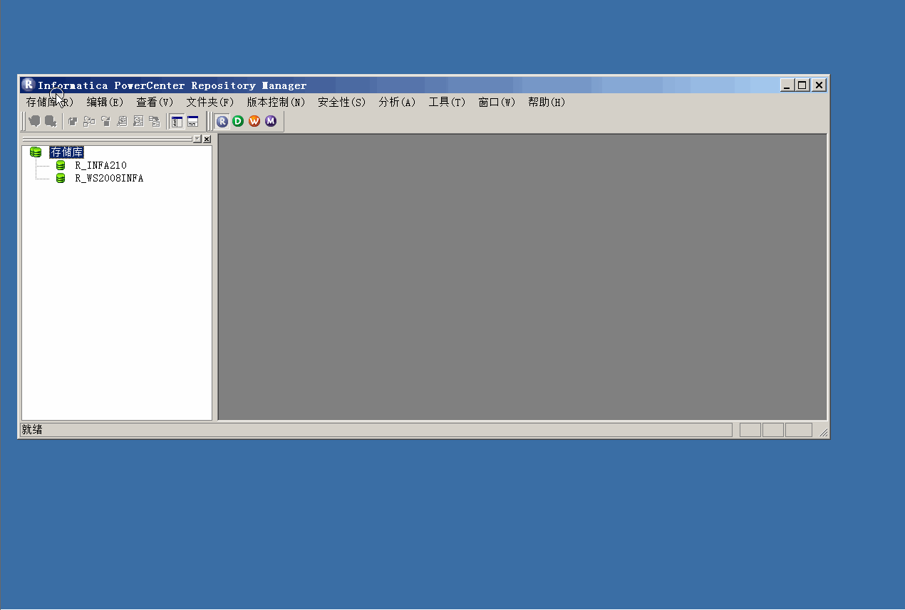

#中文环境下客户端切换成英文
种种原因，你懂的。可能你会需要在中文环境下，使用英文客户端界面完成日常工作。
但是你又不想修改操作系统的地区和语言

只需要下面的四步
* 关闭所有Informatica Clients
* 切换目录到Informatica Clients安装目录
  默认是c:\INFORMATICA\client\9.6.1\clients\PowerCenterClient\client\bin目录
* 将所有的804.dll文件剪切到804目录
* 将所有的ZH.res文件剪切到zhres目录

请参考下面的gif

